# 🛒 BazaarPilot

## AI Business Co-Pilot for Small Businesses

> **Turn everyday business data into better business decisions.**

BazaarPilot is a **Generative AI-powered business co-pilot** that helps small business owners understand their sales data and make better decisions about **revenue, profit, inventory, anomalies, and business actions**.

Users can upload a CSV or Excel sales file and interact with their data through an AI analyst. BazaarPilot supports business questions in **English, Roman Urdu, and native Urdu**, while an **in-app English/Urdu language toggle** allows users to switch the application interface between English and Urdu.

BazaarPilot combines real data analytics with agentic AI to generate grounded insights, SQL queries, inventory recommendations, and business explanations — while ensuring that **AI-generated numbers come from the actual uploaded dataset**.

---

## Problem

Small businesses generate valuable sales data every day, but many owners do not have access to a dedicated data analyst or advanced analytics tools.

As a result, important decisions are often based on intuition:

* Which products are actually making the most profit?
* Which products should be reordered?
* Why did profit decrease?
* Are sales showing any unusual patterns?
* Which products are becoming less popular?
* What should the business owner do to improve the business?

Traditional BI tools can be too complex or expensive for a small shop, while generic AI chatbots cannot reliably reason over the business's actual numbers.

There is also a language barrier for many local business owners who are more comfortable communicating in **Urdu or Roman Urdu** than English.

---

## Solution

**BazaarPilot** is an **agentic AI business co-pilot** built directly on top of a business's own sales data.

The owner uploads a CSV or Excel file, and BazaarPilot:

1. Validates and profiles the data.
2. Builds a real-time business dashboard.
3. Allows the user to switch the application interface between **English and Urdu**.
4. Lets the owner ask business questions in **English, Roman Urdu, or native Urdu**.
5. Routes each question to the appropriate specialized AI agent.
6. Performs calculations using **Pandas and DuckDB**, not the LLM.
7. Generates and safely executes read-only SQL when required.
8. Detects inventory risks and unusual sales patterns.
9. Generates grounded business insights and recommendations.
10. Presents proposed actions for **human approval** before recording them.

---

# What Makes BazaarPilot Different?

Unlike a generic LLM chatbot, BazaarPilot does not ask the AI to guess business numbers.

All important calculations are performed directly against the uploaded dataset using **Pandas or DuckDB**.

The LLM is primarily responsible for:

* Understanding the user's question
* Routing the question to the correct agent
* Generating read-only SQL
* Explaining verified results
* Generating insights in the user's preferred language

The Insight Agent receives computed results from the analytics layer and narrates **only verified data**.

This creates a **grounded AI architecture** where judges can compare the AI explanation with the underlying dataset during a live demonstration.

---

# Key Features

## 📁 CSV / Excel Data Upload

* Upload CSV or Excel sales data
* Automatic data validation
* Data profiling
* Missing-value detection
* Duplicate detection
* Data-quality scoring
* Automatic loading into DuckDB

---

## 📊 Business Dashboard

Automatically generates:

* Revenue KPIs
* Profit KPIs
* Sales trends
* Profit trends
* Top products
* Category performance
* Business alerts
* Interactive charts

All metrics are calculated from the actual uploaded dataset.

---

## 🌐 English / Urdu Application Toggle

BazaarPilot includes an **in-app language toggle** that allows users to switch the application interface between:

**🇬🇧 English ↔ 🇵🇰 Urdu**

The toggle changes the application's visible interface, including relevant:

* Navigation labels
* Dashboard labels
* Buttons
* Section headings
* Business analytics terminology
* AI interaction elements
* Application messages

This makes BazaarPilot more accessible to Urdu-speaking small business owners.

---

## 💬 Multilingual Business Questions

Users can ask questions in:

* **English**
* **Roman Urdu**
* **Native Urdu script**

For example:

**English:**

> Which products should I reorder?

**Roman Urdu:**

> Mujhe batao konsa maal dobara order karna chahiye?

**Urdu:**

> مجھے بتائیں کون سا مال دوبارہ آرڈر کرنا چاہیے؟

The questions are analyzed against the same underlying business dataset.

---

## 🧠 Agentic AI Routing

BazaarPilot uses a **LangGraph supervisor-router architecture** to classify business questions and route them to specialized analysis agents.

The system supports six major analysis types:

* Analytics
* Profit
* Inventory
* Anomaly
* Recommendation
* General business insights

---

## 🔎 Natural Language → SQL

Users can ask questions such as:

> What are my top 10 products by revenue?

The SQL/Data Analyst Agent converts the question into a **read-only DuckDB SQL query**, validates it, executes it against the uploaded dataset, and returns verified results.

This allows non-technical business owners to perform data analysis without writing SQL themselves.

---

## 📦 Inventory Intelligence

The Inventory Agent provides:

* Current inventory analysis
* Average daily sales
* Days-until-stockout estimation
* Inventory risk detection
* Reorder quantity suggestions

---

## 📉 Anomaly Detection

BazaarPilot analyzes sales patterns to identify:

* Unusual sales drops
* Sales spikes
* Product-level deviations
* Potentially concerning trends
* Severity levels

---

## 🤖 AI Business Recommendations

The Recommendation Agent combines:

* Sales velocity
* Inventory risk
* Profit margin
* Product performance

to generate ranked business recommendations.

For example:

> Which products should I reorder?

BazaarPilot analyzes the actual inventory and sales data before recommending products.

---

## ✅ Human-in-the-Loop Approval

BazaarPilot follows the principle:

> **AI can recommend. The human decides.**

If the AI proposes a business action, such as reordering a product, the action is presented for human review.

The owner can:

**Approve → or → Reject**

The decision is then recorded in the activity log.

No real supplier, payment, or inventory action is automatically executed.

---

## 🚨 Business Alerts

The dashboard provides at-a-glance alerts for important business events such as:

* Critical inventory levels
* Sales declines
* Sales spikes
* Unusual product behavior
* Inventory risks

---

## 🔐 Secure API Key Handling

No API keys are hardcoded in the source code.

BazaarPilot supports:

* `.env`
* Streamlit Secrets

Sensitive configuration files are excluded using `.gitignore`.

---

## Agentic Architecture

BazaarPilot uses a **LangGraph supervisor-router** pattern: one classification step decides which specialist agent handles the question, and every path converges on a shared visualization + insight-narration stage so behavior (multilingual output, "no invented numbers") stays consistent across all agents.


This separation makes the **"no invented numbers"** principle enforceable at the architecture level rather than relying only on an LLM prompt.

---

# How It Works

### 1. Upload

The user uploads a CSV/XLSX file or loads the bundled sample sales dataset.

### 2. Validate & Profile

Pandas checks:

* Columns
* Data types
* Missing values
* Duplicates
* Basic statistics

The cleaned dataset is loaded into a DuckDB `sales` table.

### 3. Dashboard

BazaarPilot generates:

* Revenue KPIs
* Profit KPIs
* Sales trends
* Product rankings
* Category performance
* Business alerts

All values are calculated from the actual dataset.

### 4. Choose Language

The user can use the **English / Urdu language toggle** to switch the application interface.

```text
English  ⇄  اردو
```

The selected language controls the localized application experience.

### 5. Ask a Business Question

The user can type a question in:

* English
* Roman Urdu
* Urdu script

Example:

> میری دکان میں سب سے زیادہ منافع کس پروڈکٹ سے آ رہا ہے؟

### 6. Route

The Supervisor classifies the question into one of six analysis categories.

### 7. Analyze

The appropriate agent performs the analysis using DuckDB or Pandas.

### 8. Explain

The Insight Agent receives the verified results and generates a natural-language explanation.

The system supports responses in the appropriate language/script based on the user's interaction.

### 9. Recommend

If the analysis produces a potential business action, BazaarPilot presents it as a proposed action.

### 10. Approve

The business owner can:

**Approve** or **Reject**

the proposed action.

The decision is recorded in the activity log.

---

# Technology Stack

| Layer                   | Technology                 |
| ----------------------- | -------------------------- |
| UI                      | Streamlit                  |
| Data Processing         | Pandas, OpenPyXL           |
| Analytical Query Engine | DuckDB                     |
| Agent Orchestration     | LangGraph                  |
| LLM                     | Groq API                   |
| Model                   | Llama                      |
| Charts                  | Plotly                     |
| Anomaly Detection       | IQR / Percentage Deviation |
| Multilingual Support    | Custom i18n + LLM          |
| Deployment              | Streamlit Community Cloud  |

The architecture intentionally keeps the stack lightweight.

There are no unnecessary microservices, Kubernetes clusters, or enterprise infrastructure requirements, making BazaarPilot suitable for a small-business use case and a fast live demonstration.

---

# Dataset

The repository includes:

```text
data/sample_sales.csv
```

The dataset is synthetic but designed to demonstrate realistic business scenarios.

It contains:

* Multiple months of sales
* Multiple product categories
* High-margin products
* High-volume products
* Rising product demand
* Declining product demand
* Inventory risks
* Potential sales anomalies

All analytics are calculated live from this file or from an uploaded dataset with compatible columns.

Nothing is precomputed or hardcoded for the demo.

---

# AI / GenAI Components

## Supervisor / Router

Uses LLM-based intent classification with a deterministic keyword fallback for reliability.

## Natural Language → SQL

The SQL Agent converts business questions into read-only DuckDB queries.

Generated SQL is validated before execution.

## Grounded Narration

The Insight Agent is designed to narrate only verified results returned by the analytics layer.

## Multilingual Understanding

BazaarPilot understands business questions in:

* English
* Roman Urdu
* Urdu script

## English / Urdu UI Localization

The application includes a dedicated language toggle that switches the user interface between English and Urdu.

This is implemented through the application's localization layer rather than being limited to AI-generated translations.

---

# Business Analytics

BazaarPilot provides several practical business analytics capabilities.

## Revenue & Profit

* Revenue aggregation
* Profit aggregation
* Cost analysis
* Quantity analysis
* Product rankings
* Category rankings

## Profit Comparison

The Profit Agent can compare periods and identify contributors to profit changes.

For example:

> Why did my profit decrease?

The system analyzes the underlying sales data rather than asking the LLM to guess the reason.

## Inventory Stockout Prediction

BazaarPilot estimates:

```text
days_until_stockout =
current_inventory / average_daily_sales
```

## Reorder Recommendation

The system estimates expected demand and calculates a recommended reorder quantity using expected demand and a safety buffer.

## Anomaly Detection

Recent sales performance is compared with historical performance.

Products exceeding the configured deviation threshold can be flagged as:

* Mild
* Moderate
* Severe

---

# Responsible AI & Human Approval

BazaarPilot is designed around a simple principle:

> **AI can recommend. The human decides.**

The system does not connect to a real supplier, payment system, or inventory management system.

Every business action generated by the AI is treated as a **proposed action**.

For example:

```text
AI Recommendation
        ↓
Proposed Reorder
        ↓
Human Review
        ↓
Approve / Reject
        ↓
Activity Log
```

This demonstrates a practical **human-in-the-loop agentic AI workflow**.

All approved and rejected decisions are recorded in a visible, session-scoped activity log.

---

# SDG Alignment

## SDG 8 — Decent Work and Economic Growth

**Primary alignment**

BazaarPilot gives small businesses access to practical data-driven decision support without requiring a dedicated data analyst or expensive BI platform.

By helping owners understand sales, profit, inventory, and business trends, the system can support more informed business decisions and resource utilization.

## SDG 9 — Industry, Innovation and Infrastructure

**Secondary alignment**

BazaarPilot demonstrates how lightweight Generative AI and agentic AI infrastructure can be applied to a real-world business problem without requiring large enterprise infrastructure.

---

# Screenshots

## Overview Dashboard

### English Version

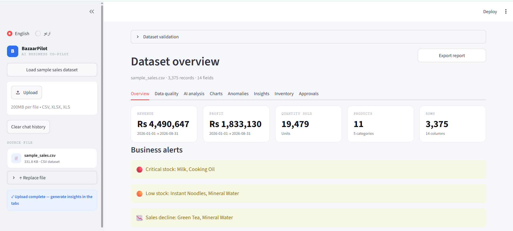

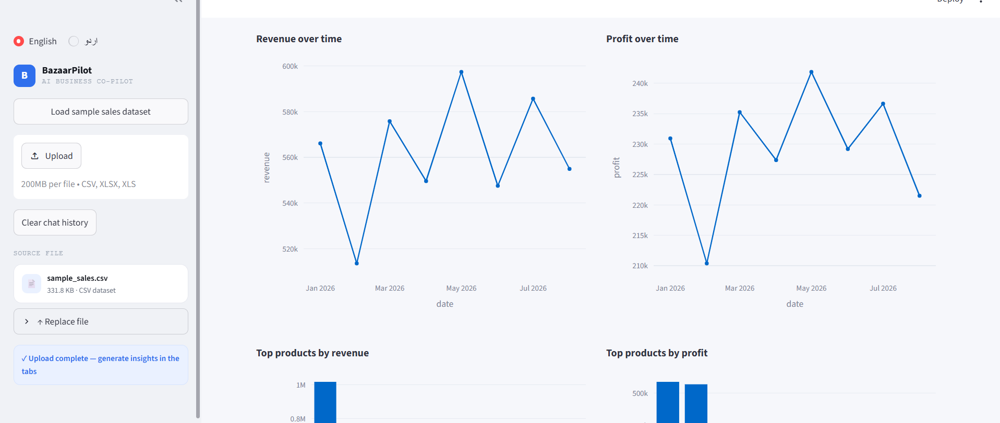

### Urdu Version

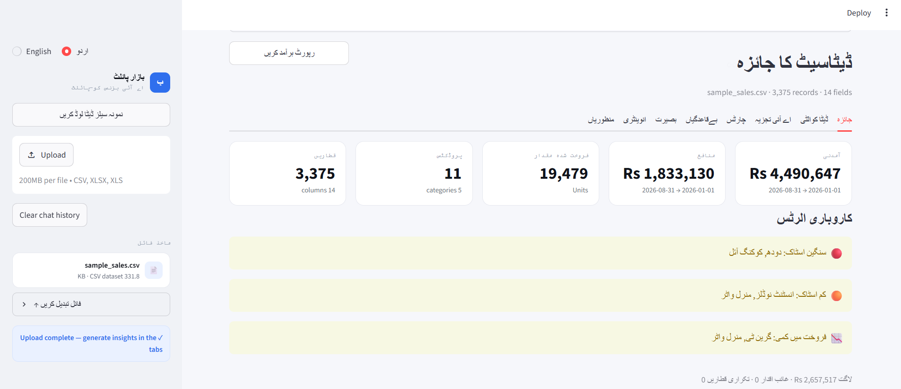

---

## AI Analyst

The AI Analyst allows business owners to ask questions about their actual sales data and receive grounded answers with generated SQL.

### English Version

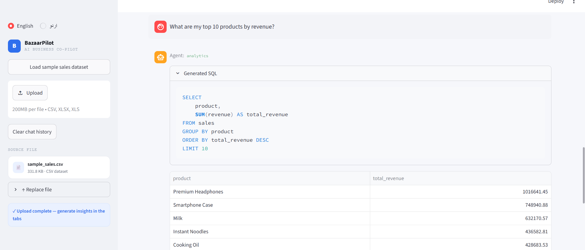

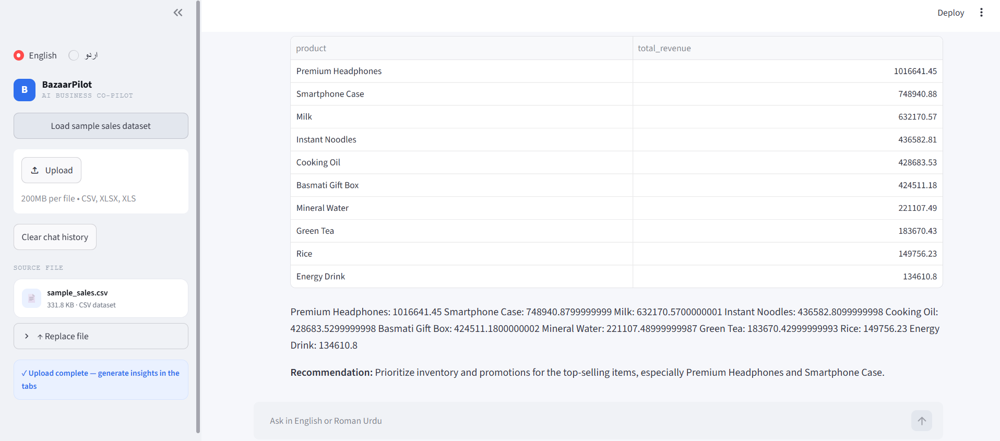

### Urdu Version

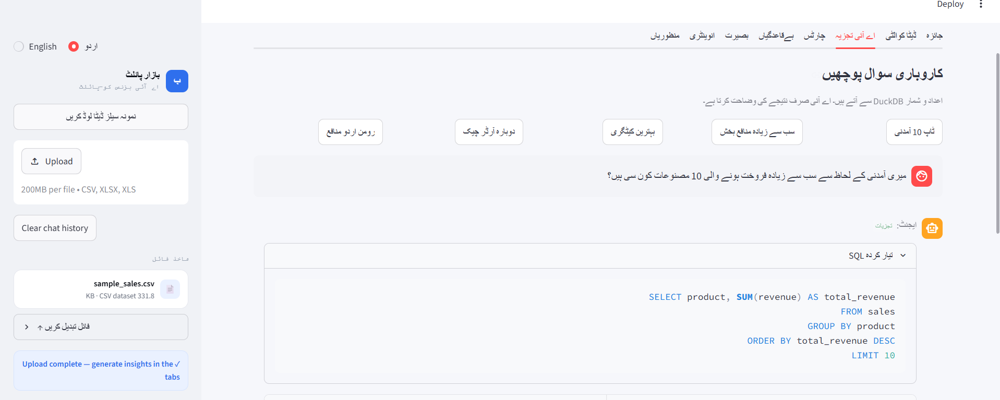

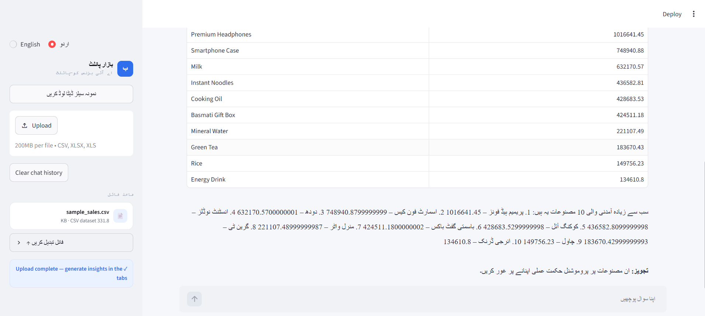

---

## Inventory Analysis

Inventory analysis identifies stock risks and provides reorder recommendations.

### English Version

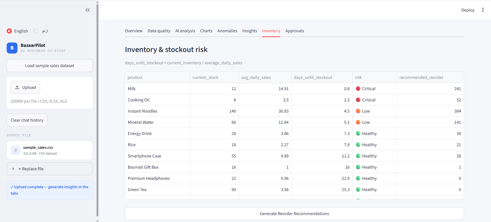

### Urdu Version

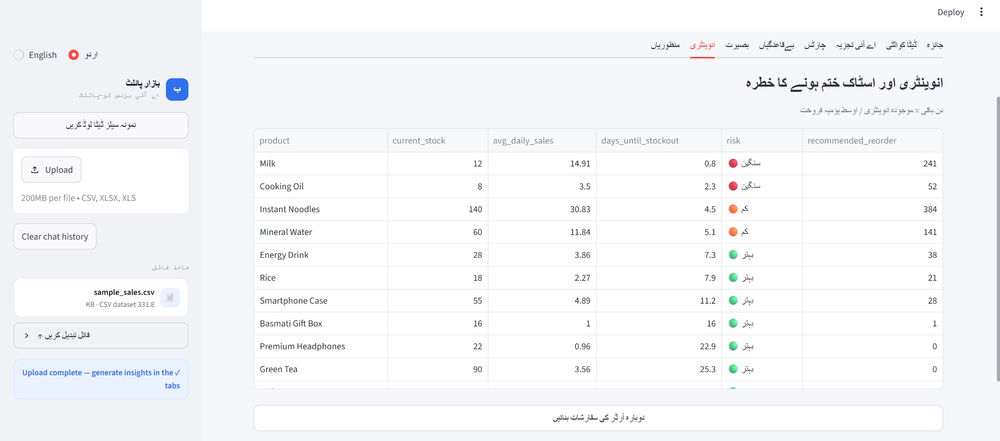

---

## Approvals & Activity Log

BazaarPilot uses a human-in-the-loop approval workflow for proposed business actions.

### English Version

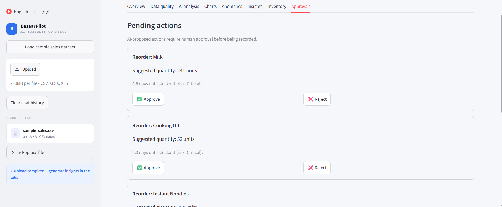

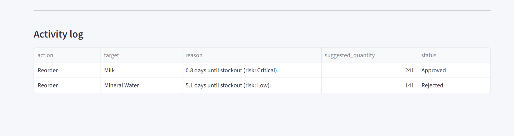

### Urdu Version

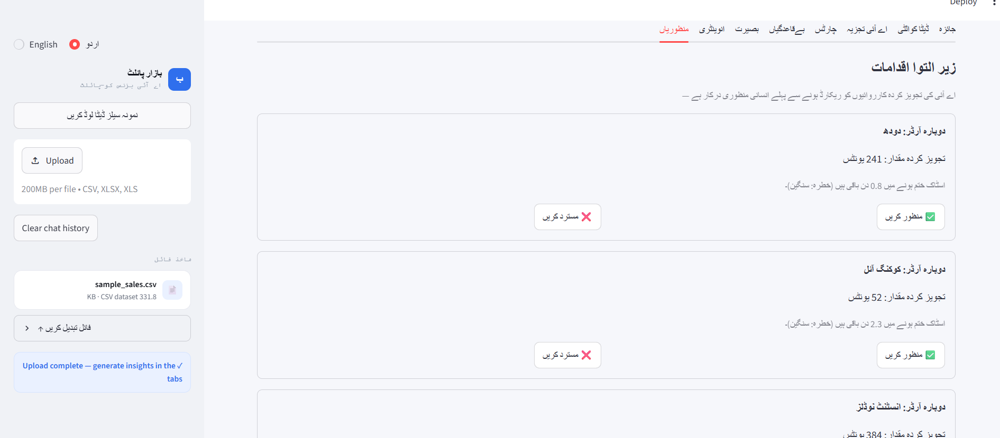

---

# Installation

Clone the repository:

```bash
git clone https://github.com/rabia020/BazaarPilot.git
cd BazaarPilot
```

Create a virtual environment:

```bash
python -m venv .venv
```

Activate it on Windows:

```bash
.venv\Scripts\activate
```

Install dependencies:

```bash
pip install -r requirements.txt
```

---

# Environment Variables

Create a `.env` file in the project root:

```env
GROQ_API_KEY=your_api_key_here
```

An example configuration is provided in:

```text
.env.example
```

The `.env` file should never be committed to GitHub.

For Streamlit Community Cloud deployment, add the API key through **Streamlit Secrets**.

---

# Running Locally

Start the Streamlit application:

```bash
streamlit run app/main.py
```

Then open the local URL shown by Streamlit, usually:

```text
http://localhost:8501
```

Load the sample sales dataset and try the demo questions.

---

# Deployment

BazaarPilot is designed for deployment on **Streamlit Community Cloud**.

### Live Application


[Try BazaarPilot Live](https://bazaarpilot-eq72zge9ufrrbvkfmenyrl.streamlit.app/)

### GitHub Repository

https://github.com/rabia020/BazaarPilot

---

# Demo Questions

## 🇬🇧 English

1. **What are my top 10 products by revenue?**
2. **Which products are most profitable?**
3. **Which products should I reorder?**
4. **Why did my profit decrease?**
5. **Are there any unusual sales patterns?**
6. **What should I do to improve my business?**

## 🇵🇰 Roman Urdu

7. **Meri shop mein sab se zyada profit kis product se aa raha hai?**
8. **Mujhe batao konsa maal dobara order karna chahiye?**
9. **Profit kyun kam hua?**
10. **Meri shop ki sales mein koi unusual trend hai?**
11. **Meri business performance ko behtar karne ke liye mujhe kya karna chahiye?**

## 🇵🇰 Urdu

12. **میری دکان میں سب سے زیادہ منافع کس پروڈکٹ سے آ رہا ہے؟**
13. **مجھے بتائیں کون سا مال دوبارہ آرڈر کرنا چاہیے؟**
14. **منافع کیوں کم ہوا؟**
15. **کیا میری سیلز میں کوئی غیر معمولی رجحان ہے؟**
16. **اپنے کاروبار کو بہتر کرنے کے لیے مجھے کیا کرنا چاہیے؟**

---

# Future Improvements

* Persistent activity logs and uploaded datasets using SQLite
* Real time-series forecasting for demand prediction
* Multi-file and multi-period comparisons
* Configurable recommendation rules for different shop types
* Supplier integration with human approval
* Voice input for Roman Urdu and Urdu
* Expanded Urdu localization
* Additional business KPIs and financial analytics
* Role-based access for multiple business users

---


Built for:

**HEC-NCEAC & PEC Generative & Agentic AI Training — Cohort 11**
**Midterm — Hackathon 1**

---

> **BazaarPilot turns everyday business data into actionable business decisions — in English or Urdu, using the language that works best for the business owner.**
