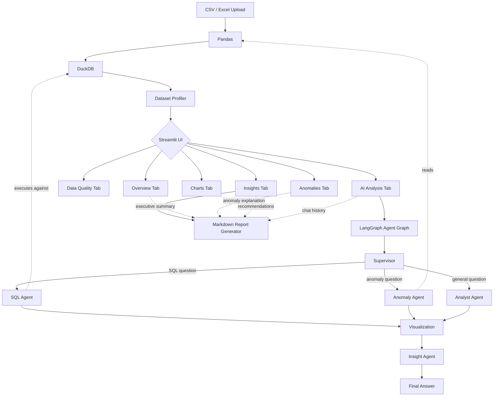
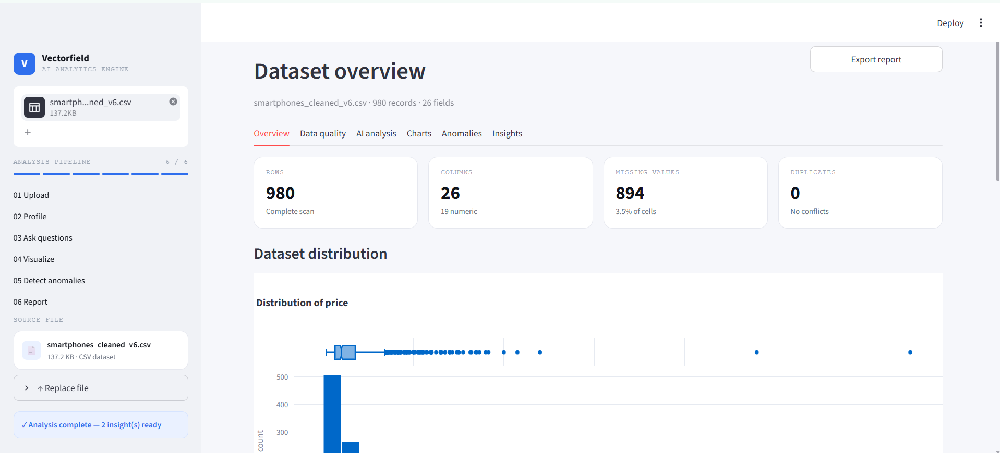
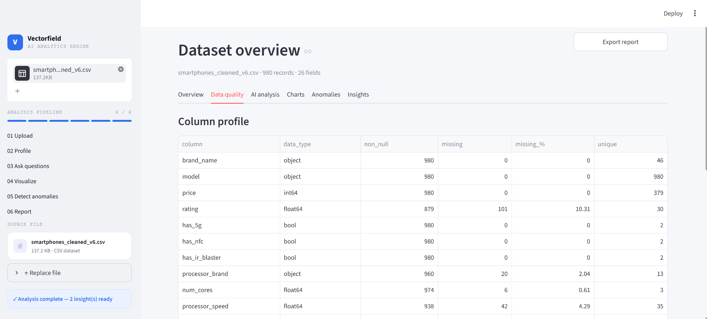
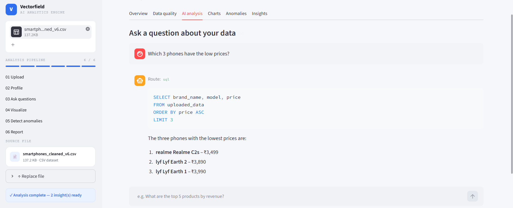
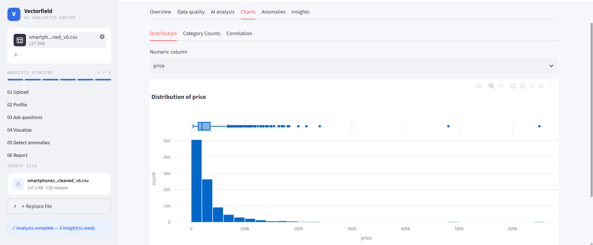
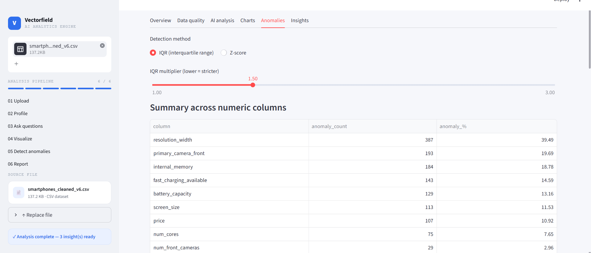
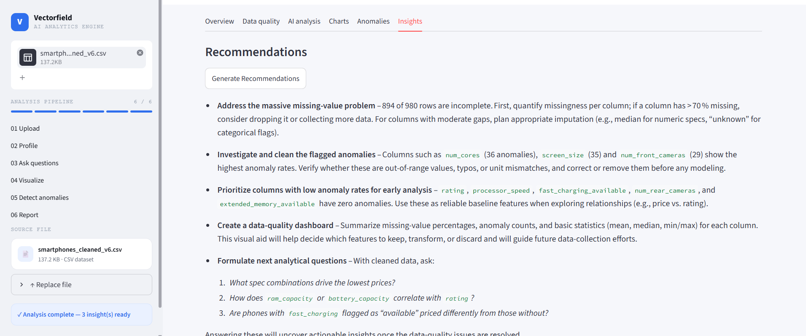

# 📊 AI Analytics Engine

An end-to-end analytics application that turns any CSV/Excel upload into a profiled,
queryable, visualized, and AI-narrated dataset — built over three days as a
progressively more capable system: from a simple data profiler to a fully agentic,
LangGraph-orchestrated analytics assistant.

## Features

- **Upload & Profile** — CSV/Excel ingestion via Pandas, registered into DuckDB for
  fast SQL, with automatic row/column counts, missing values, duplicates, and
  per-column data quality metrics.
- **Natural-Language SQL** — ask questions in plain English; an LLM (via Groq, running
  open-weight models) generates DuckDB SQL, which is validated against a safety layer
  before execution.
- **Agentic Layer (LangGraph)** — a Supervisor node routes each question to the right
  specialist agent (SQL, anomaly detection, or general analysis), each of which can
  hand off to a shared Visualization and Insight-summarization step.
- **Charts** — Plotly-powered distribution histograms, categorical bar charts, and
  correlation heatmaps.
- **Anomaly Detection** — IQR and Z-score based outlier detection across every numeric
  column, with adjustable sensitivity and an LLM-generated plain-English explanation.
- **Executive Summary & Recommendations** — LLM-generated, grounded strictly in the
  computed statistics (never invented numbers).
- **Conversation History** — every question and answer in the AI Analysis tab persists
  for the session and gets included in the final report.
- **Downloadable Report** — a single Markdown report combining the executive summary,
  data quality findings, anomalies, recommendations, and full Q&A history.

## Architecture



## Tech Stack

| Layer | Tool |
|---|---|
| UI | Streamlit |
| Data handling | Pandas |
| Analytical SQL | DuckDB |
| Charts | Plotly |
| LLM inference | Groq API (open-weight models, e.g. `openai/gpt-oss-120b`) |
| Agent orchestration | LangGraph + LangChain |

## Project Structure

```text
analytics_engine
├── app/
│   ├── main.py              # main tabbed Streamlit app
│   ├── profiler.py          # dataset & column profiling
│   ├── charts.py            # Plotly chart builders
│   ├── anomaly.py           # IQR / Z-score anomaly detection
│   ├── ai_insights.py       # executive summary, recommendations, anomaly explanations
│   ├── report_generator.py  # downloadable Markdown report builder
│   ├── sql_agent.py         # standalone NL-to-SQL agent (pre-LangGraph)
│   └── llm_client.py        # Groq client for the standalone SQL agent
├── agentic
│   ├── graph.py              # LangGraph StateGraph wiring
│   ├── supervisor.py         # routes each question to a specialist
│   ├── sql_agent.py          # generates + validates + executes SQL
│   ├── anomaly_agent.py      # IQR-based anomaly detection node
│   ├── analyst_agent.py      # general-analysis node
│   ├── visualization.py      # shared visualization-prep node
│   ├── insight_agent.py      # final answer synthesis node
│   ├── state.py              # shared AgentState schema
│   └── llm.py                # LangChain/Groq LLM wrapper
├── sample_data/
│   └── smartphones_cleaned_v6.csv
├── .env                       # GROQ_API_KEY, GROQ_MODEL (not committed)
├── .gitignore
├── README.md
└── requirements.txt
```

## Setup

```bash
python -m venv .venv
.venv\Scripts\activate        # Windows
# source .venv/bin/activate   # macOS/Linux

pip install -r requirements.txt
```

Create a `.env` file in the project root:

```text
GROQ_API_KEY=your_groq_api_key_here
GROQ_MODEL=openai/gpt-oss-120b
```

Get a free key at [console.groq.com](https://console.groq.com) — no card required.

## Run

```bash
streamlit run app/main.py
```

Upload `sample_data/smartphones_cleaned_v6.csv` (included in this repo) to try it
immediately, or use your own CSV/Excel file.

## Example Questions to Try

| Route | Example |
|---|---|
| SQL | "What are the top 5 products by price?" |
| Anomaly | "Are there any unusual price values?" |
| General Analysis | "What types of columns are in this dataset?" |

## Screenshots

*Captured using a sample smartphone-specs dataset to demonstrate the full feature set — you can upload any CSV/Excel file of your own.*

| Overview | Data Quality | AI Analysis |
|---|---|---|
|  |  |  |

| Charts | Anomalies | Insights |
|---|---|---|
|  |  |  |

## Demo Video

[](https://drive.google.com/file/d/1fW8uP2zfXRwTUJAcqK1opn4q_7GweBog/view?usp=sharing)

*Click the image above to watch the full demo (opens in Google Drive).*

## Roadmap / Possible Extensions

- PDF export of the report (currently Markdown only)
- Multi-dataset comparison
- Persistent conversation history across sessions (currently per-session only)
- Additional anomaly detection methods (isolation forest, DBSCAN)