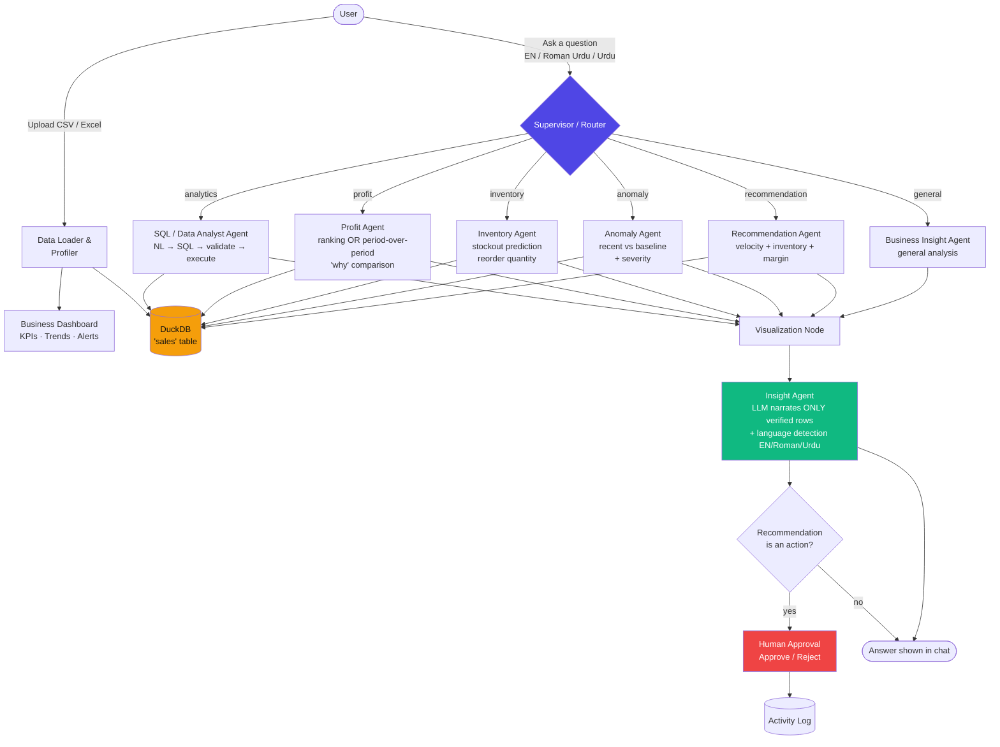

# 🛒 BazaarPilot

**AI Business Co-Pilot for Small Businesses**

> "Turn everyday business data into better decisions."

BazaarPilot lets a small shop owner upload a sales spreadsheet and instantly get a real analytics dashboard, a conversational AI analyst that writes and runs SQL against their own data, inventory stockout predictions, anomaly detection, and AI-generated business recommendations — with every number traced back to the actual dataset, never invented by the AI.

---

## Problem

Small businesses generate sales data every day — but very few have access to a data analyst. Owners make decisions on intuition: when to reorder stock, which products are actually profitable, why revenue dipped last month. Off-the-shelf BI tools are too complex or too expensive for a small shop, and generic chatbots can't see or reason over the business's real numbers.

## Solution

BazaarPilot is an **agentic AI co-pilot** that sits directly on top of a business's own sales data. Upload a CSV or Excel file, and a team of specialized AI agents — routed by a supervisor — analyzes it: computing real metrics in DuckDB/Pandas, generating SQL on demand, predicting stockouts, flagging anomalies, and turning all of that into plain-language explanations and recommendations in **English or Roman/native Urdu**. Every AI-proposed action requires human approval before being logged — nothing is executed automatically.

## Differentiator

Unlike a generic LLM chatbot, BazaarPilot never lets the AI invent numbers. All calculations run in DuckDB or Pandas against the real uploaded dataset; the LLM's only job is routing, SQL generation, and narrating verified results — a "grounded AI" architecture judges can verify live by comparing the AI's explanation to the table shown right above it.

---

## Key Features

- 📁 CSV / Excel upload with validation, profiling, and data-quality scoring
- 📊 Auto-generated dashboard: revenue/profit trends, top products, category performance
- 💬 Natural-language business Q&A in **English, Roman Urdu, and native Urdu script**
- 🧠 Agentic routing across 6 specialized analysis types (analytics, profit, inventory, anomaly, recommendation, general)
- 🔎 Live NL→SQL generation with read-only safety validation, executed on DuckDB
- 📦 Inventory agent: days-until-stockout prediction and reorder quantity suggestions
- 📉 Anomaly detection: per-product sales-trend deviation with severity scoring
- 🤖 Recommendation engine: combines sales velocity, inventory risk, and profit margin into ranked actions
- ✅ Human-in-the-loop approval workflow with a persistent activity log
- 🚨 At-a-glance business alerts strip (critical stock, sales spikes/declines, anomalies)
- 🔐 No hardcoded API keys — Streamlit secrets / `.env`, both gitignored

---

## Agentic Architecture

BazaarPilot uses a **LangGraph supervisor-router** pattern: one classification step decides which specialist agent handles the question, and every path converges on a shared visualization + insight-narration stage so behavior (multilingual output, "no invented numbers") stays consistent across all agents.



**Why this design:** the supervisor makes routing a single, debuggable decision point instead of a tangle of autonomous loops. Every specialist agent returns raw, computed rows (`sql_result`) — never text answers directly — so the Insight Agent is the *only* place an LLM narrates numbers, and it's constrained to copy figures verbatim from those rows. This is what makes the "no invented numbers" guarantee enforceable rather than just a prompt instruction.

---

## How It Works

1. **Upload** — user uploads a CSV/XLSX file, or loads the bundled sample dataset.
2. **Validate & Profile** — Pandas checks columns, types, missing values, duplicates; DuckDB loads the cleaned data into a `sales` table.
3. **Dashboard** — KPI cards, revenue/profit trends, top products, category performance, and a business-alerts strip render immediately from real aggregates.
4. **Ask a question** — typed or picked from example buttons, in English, Roman Urdu, or Urdu script.
5. **Route** — the Supervisor (LLM + keyword fallback) classifies the question into one of six categories.
6. **Analyze** — the matching agent computes results directly from DuckDB/Pandas — SQL query, stockout math, anomaly scan, or recommendation scoring.
7. **Explain** — the Insight Agent asks the LLM to narrate *only* the returned rows, detects the question's script, and replies in the matching language (with a parallel Urdu-script section for Roman Urdu questions).
8. **Approve** — if the answer includes a proposed action (e.g. a reorder), it's added to the Approvals tab; the user must click Approve or Reject before it's recorded in the activity log. No real action is ever taken automatically.

---

## Technology Stack

| Layer | Technology |
|---|---|
| UI | Streamlit |
| Data processing | Pandas, openpyxl |
| Analytical query engine | DuckDB (read-only, validated SQL) |
| Agent orchestration | LangGraph |
| LLM | Groq API (Llama 3.1) |
| Charts | Plotly |
| Anomaly detection | IQR / percentage-deviation statistics |
| Deployment | Streamlit Community Cloud |

No PostgreSQL, no microservices, no Kubernetes — the stack is deliberately kept small enough to deploy in minutes and debug during a live demo.

---

## Dataset

`data/sample_sales.csv` is a synthetic but realistic multi-month dataset with intentional patterns for a compelling demo:

- Several months of daily sales across multiple categories
- A mix of high-margin and high-volume products
- Products with visibly rising or declining demand
- At least one product with a genuine stockout risk
- At least one product with an obvious anomalous drop, for the Anomaly Agent to catch

All analytics are computed live from this file (or any uploaded file with equivalent columns) — nothing is precomputed or faked for the demo.

---

## AI / GenAI Components

- **Supervisor / Router** — LLM-based intent classification with a deterministic keyword fallback for reliability
- **NL → SQL generation** — the SQL Agent asks the LLM for one read-only DuckDB query per question, validated before execution
- **Grounded narration** — the Insight Agent's prompt explicitly forbids inventing or rounding figures; it can only restate numbers present in the verified query result
- **Bilingual/script-aware generation** — automatic detection of English vs Roman Urdu vs native Urdu script, with correct RTL rendering for Urdu output

## Business Analytics

- Revenue, profit, cost, and quantity aggregation (Pandas/DuckDB, not the LLM)
- Top/bottom product and category ranking
- Period-over-period profit comparison with contributor breakdown ("why did profit change")
- Inventory stockout prediction: `days_until_stockout = current_inventory / average_daily_sales`
- Reorder quantity: covers 14 days of expected demand plus a 3-day safety buffer, minus current stock
- Anomaly detection: recent 7-day average vs historical baseline, flagged at ≥30% deviation, with Mild/Moderate/Severe severity

## Responsible AI / Human Approval

BazaarPilot never lets the AI take a real action. Every reorder or business recommendation is surfaced as a **proposed action** that a human must explicitly Approve or Reject in the Approvals tab. All decisions — approved or rejected — are written to a visible, session-scoped activity log. This is demo/simulation functionality only: BazaarPilot does not integrate with any real supplier, payment, or inventory system.

## SDG Alignment

- **SDG 8 — Decent Work and Economic Growth (primary):** gives small businesses, who typically lack a dedicated analyst, direct access to the kind of data-driven decision support larger companies take for granted.
- **SDG 9 — Industry, Innovation and Infrastructure (secondary):** demonstrates how lightweight agentic AI infrastructure can be deployed affordably, without enterprise BI budgets.

---

## Screenshots

*(Add screenshots of the Overview dashboard, AI Analyst chat with generated SQL, Inventory tab, and Approvals tab here before submission.)*

```
assets/
  ├── screenshot_dashboard.png
  ├── screenshot_ai_analyst.png
  ├── screenshot_inventory.png
  └── screenshot_approvals.png
```

---

## Installation

```bash
git clone https://github.com/<your-username>/BazaarPilot.git
cd BazaarPilot
python -m venv .venv
.venv\Scripts\activate        # Windows
pip install -r requirements.txt
```

## Environment Variables

Create a `.env` file in the project root (never commit this file):

```
GROQ_API_KEY=your_api_key_here
```

An example is provided in `.env.example`. For deployment, the same key is added to Streamlit Cloud's **Secrets** instead (see Deployment below) — never hardcoded in source.

## Running Locally

```bash
streamlit run app/main.py
```

Then open the local URL Streamlit prints (usually `http://localhost:8501`), click **Load sample sales dataset**, and try the demo questions below.

## Deployment

Deployed on Streamlit Community Cloud.

**Live app:** `<add your public Streamlit URL here>`
**Repository:** `<add your GitHub repo URL here>`

---

## Demo Questions

1. "What are my top 10 products by revenue?"
2. "Which products are most profitable?"
3. "Which products should I reorder?"
4. "Why did my profit decrease?"
5. "Are there any unusual sales patterns?"
6. "Meri shop mein sab se zyada profit kis product se aa raha hai?"
7. "Mujhe batao konsa maal dobara order karna chahiye?"

## Future Improvements

- Persist the activity log and uploaded datasets beyond a single session (SQLite)
- Real forecasting (e.g. simple time-series models) instead of average-based stockout estimates
- Multi-file / multi-period comparison across uploads
- Expand recommendation scoring with configurable business rules per shop type
- Voice input for Roman Urdu / Urdu questions

## Author

Built for [Hackathon Name] by [Your Name].

---

*BazaarPilot turns everyday business data into actionable decisions.*